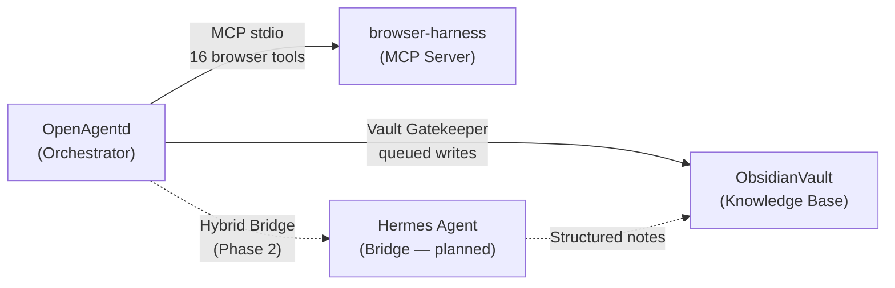

# 🤖 ai-agents — Hybrid AI Agent Ecosystem

A comprehensive hybrid AI agent ecosystem that seamlessly integrates multiple specialized tools into a unified architecture for local AI agent orchestration.

## 🏗️ Architecture

```
ai-agents/
├── OpenAgentd/        # 🎛️ Desktop cockpit for local AI agents (submodule)
├── browser-harness/   # 🌐 Browser automation via MCP (submodule)
└── ObsidianVault/     # 🧠 Knowledge base — Obsidian-compatible vault
```

### Components

| Component | Purpose | Tech Stack |
|---|---|---|
| **[OpenAgentd](./OpenAgentd/)** | Multi-agent desktop cockpit with real-time UI, persistent memory, and team coordination | Python 3.14, FastAPI, React 19, Tauri v2 |
| **[browser-harness](./browser-harness/)** | Browser automation agent via MCP protocol for web tasks | Python, Browser Use, MCP stdio |
| **[ObsidianVault](./ObsidianVault/)** | AI-readable knowledge vault with PARA structure and WikiLinks | Markdown, YAML Frontmatter |

### Integration Flow



## 🚀 Quick Start

### Prerequisites
- Python ≥ 3.14
- Node.js (for web UI)
- Git

### Setup

```bash
# Clone with submodules
git clone --recursive https://github.com/LNK27/ai-agents.git
cd ai-agents

# Setup OpenAgentd
cd OpenAgentd
uv sync
cp .env.example .env  # Edit with your API keys
cd ..

# Setup browser-harness
cd browser-harness
uv sync
cp .env.example .env  # Edit with your API keys
cd ..
```

### Run

```bash
# Start OpenAgentd server
cd OpenAgentd
uv run uvicorn app.server:app --reload --port 4082
```

## 🔐 Security

- **Never commit `.env` files** — they contain API keys
- Each component has its own `.env.example` template
- Shell Permission Gate prevents injection attacks
- Vault Gatekeeper enforces queued, non-destructive writes

## 📋 Project Status

| Phase | Status | Description |
|---|---|---|
| Phase 1 | ✅ Complete | Core Runtime: MCP lifecycle, shell permissions, vault skeleton |
| Phase 2 | 🔧 In Progress | Memory Workflow: Vault Gatekeeper, Human Ingest, Hermes Bridge |

## 📄 License

[Apache License 2.0](./OpenAgentd/LICENSE) — Free for personal, research, and commercial use.
